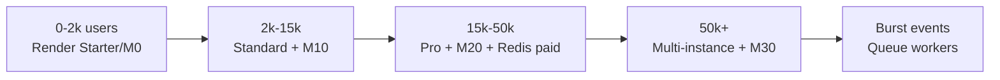

# Vedaansh — Infrastructure Cost Plan (Render + Atlas + Upstash)

**Product:** Vedaansh (Jyotish platform) · **Stack:** Next.js 14 on Render, MongoDB Atlas, Upstash Redis, Resend  
**Region today:** Render Singapore · **Pricing basis:** USD, public list prices (May 2026)  
**INR reference:** ~₹85 per $1 (adjust with live FX)

Use this document for budgeting, investor slides, and “when do we upgrade?” decisions.

---

## 1. What you are paying for today

| Service | Role in Vedaansh | Current config (from repo) |
|--------|-------------------|----------------------------|
| **Render Web Service** | Hosts Next.js (`npm start`), Swiss Ephemeris (`sweph`), chart API | `plan: free`, Singapore, 512 MB RAM, `--max-old-space-size=450` |
| **MongoDB Atlas** | Users, charts, payments, NextAuth adapter | `MONGODB_URI` — tier chosen in Atlas console |
| **Upstash Redis** | Chart cache (24h), atlas/tz L1+L2, rate limits | Pay-as-you-go or free; optional (no-op if unset) |
| **Resend** | Auth / transactional email | API key in env |
| **Razorpay** | Payments (not hosting) | ~2% + GST per transaction |
| **Google OAuth** | Login | Free |
| **Domain (vedaansh.com)** | DNS + registrar | ~$10–15/year |

**Important:** Render **Free** is not for production at scale. Services sleep after inactivity, have no SLA, and share 0.1 CPU — chart calculation (`/api/chart/calculate`) is CPU-heavy and will time out under load.

---

## 2. Definitions (read before the numbers)

| Term | Meaning in this doc |
|------|---------------------|
| **Registered users** | Accounts in MongoDB (your 1k / 3k / … / 100k columns) |
| **MAU** | Monthly active users — assumed **30%** of registered unless noted |
| **Chart calculation** | `POST /api/chart/calculate` — runs `sweph` on Node (expensive) |
| **Cache hit** | Same birth data/settings → served from Redis (cheap) |
| **2,000 chart hits** | Special scenarios in §7 (per day, per hour burst, or concurrent) |

**Default usage profile (Moderate)** — used in main tables:

- 4 visits / registered user / month  
- 2 new chart calculations / MAU / month (rest cached or re-opened)  
- 70% Redis cache hit rate on chart API (grows with scale → 80% at 50k+)  
- ~400 KB egress per visit (HTML + API + assets average)

**Light profile:** 2 visits, 1 chart/MAU, 75% cache hit  
**Heavy profile:** 8 visits, 5 charts/MAU, 55% cache hit  

---

## 3. Upgrade matrix — plans, CPU, RAM, and monthly cost

Use this section when you ask: *“If we upgrade to X users, which plan on each provider, how much CPU/RAM, and what do we pay?”*

**Legend**

- **Instances** = number of Render web services running the same app (for redundancy or more parallel charts).  
- **Concurrent charts** = rough uncached `sweph` calculations at the same time on one instance (depends on cache; numbers are conservative).  
- **Total USD** = hosting only (Render + Atlas + Upstash + Resend); excludes Razorpay fees and domain.  
- **Workspace** = Render team plan (Hobby $0 or Pro $25/mo) — add separately if you use Pro workspace.

---

### 3.1 Master table — what to buy at each user count

| Registered users | Traffic profile | **Render plan** | RAM (per instance) | vCPU (per instance) | Instances | **MongoDB Atlas** | DB RAM | DB storage (base) | **Upstash Redis** | **Resend** | **Total USD/mo** | **~INR/mo** |
|----------------:|-----------------|-----------------|-------------------:|--------------------:|----------:|-------------------|-------:|--------------------:|-------------------|------------|-----------------:|-------------:|
| 0 – 500 | Dev / staging | Free | 512 MB | 0.1 | 1 | M0 Free | Shared | 512 MB | Free | Free | **$0** | ₹0 |
| 500 – 2,000 | Light prod | **Starter** | 512 MB | 0.5 | 1 | M0 Free | Shared | 512 MB | Free | Free | **$7–9** | ₹600–750 |
| 1,000 – 3,000 | Moderate prod | **Standard** | **2 GB** | **1** | 1 | M0 or M2 | 2 GB shared / 2 GB | 512 MB – 2 GB | Free | Free | **$25–34** | ₹2,100–2,900 |
| 3,000 – 8,000 | Growing | **Standard** | **2 GB** | **1** | 1 | **M10** | **2 GB** | **10 GB** | Free – PayGo | Free | **$82–95** | ₹7,000–8,000 |
| 8,000 – 15,000 | Moderate + charts | **Standard** | **2 GB** | **1** | 1–2 | **M10** | **2 GB** | **10 GB** | PayGo ~$5 | Free | **$95–130** | ₹8,000–11,000 |
| 15,000 – 30,000 | Higher CPU | **Pro** | **4 GB** | **2** | 1–2 | **M10** → **M20** | 2–4 GB | 10–20 GB | PayGo ~$10 | Free – Pro $20 | **$180–280** | ₹15k–24k |
| 30,000 – 50,000 | Scale | **Pro** | **4 GB** | **2** | **2** | **M20** | **4 GB** | **20 GB** | PayGo ~$25 | Pro $20 | **$320–400** | ₹27k–34k |
| 50,000 – 75,000 | Scale + bandwidth | **Pro** | **4 GB** | **2** | **2–3** | **M20** | **4 GB** | **20 GB** | PayGo ~$35 | Pro $20 | **$400–520** | ₹34k–44k |
| 75,000 – 150,000 | Large | **Pro** | **4 GB** | **2** | **3–4** | **M30** | **8 GB** | **40 GB** | PayGo ~$60 | Pro $35 | **$650–950** | ₹55k–81k |
| 150,000+ | Enterprise path | **Pro Plus** / multi **Pro** | 8 GB / 4 GB | 4 / 2 | 4+ | **M30** – **M40** | 8–16 GB | 40–80 GB | Fixed 5–10 GB | Scale $90+ | **$1,200+** | ₹1L+ |

**When to click “Upgrade” in each dashboard**

| Users | Render dashboard | Atlas dashboard | Upstash | Resend |
|------:|------------------|-----------------|---------|--------|
| &gt;500 prod | Free → **Starter** or **Standard** | Stay **M0** until storage &gt;400 MB | Enable env vars | Stay Free |
| &gt;3k | **Standard** | **M10** | Free → PayGo if commands &gt;500k/mo | Free |
| &gt;15k | **Standard** → **Pro** if CPU &gt;70% | **M10** → **M20** if RAM pressure | PayGo, set budget cap | **Pro $20** if emails &gt;3k/mo |
| &gt;50k | **2× Pro** | **M20** | PayGo or **Fixed 1 GB $20** | **Pro $20** |
| &gt;100k | **3–4× Pro** | **M30** | **Fixed 5 GB $100** or PayGo | **Pro $35** |

---

### 3.2 Render — all web service plans (CPU, RAM, price)

| Plan name | Price (USD/mo) | RAM | vCPU | Max concurrent uncached charts¹ | Best for Vedaansh |
|-----------|---------------:|----:|-----:|--------------------------------:|-------------------|
| **Free** | $0 | 512 MB | 0.1 | 0–1 (unreliable) | Local demo only — **you are here today** |
| **Starter** | $7 | 512 MB | 0.5 | 1–2 | Tiny prod, &lt;500 DAU |
| **Standard** | $25 | **2 GB** | **1** | 3–6 | **Recommended first paid upgrade** — 1k–15k users |
| **Pro** | $85 | **4 GB** | **2** | 6–12 | 15k–75k users, heavier chart traffic |
| **Pro Plus** | $175 | **8 GB** | **4** | 12–20 | Memory-heavy Next.js or few very large instances |
| **Pro Max** | $225 | **16 GB** | **4** | 15–25 | Rare; prefer 2× Pro over 1× Pro Max |
| **Pro Ultra** | $450 | **32 GB** | **8** | 25–40 | Batch/video workers, not default web app |

¹ Uncached `POST /api/chart/calculate` with `sweph`; with **Redis cache** one instance handles **3–5×** more user-facing chart views.

**Render sizing rule for Vedaansh**

| Goal | Rule of thumb |
|------|----------------|
| RAM | Need **≥2 GB** for stable `sweph` + Next.js (`NODE_OPTIONS` already uses ~450 MB heap). |
| CPU | Add **1 vCPU** (Standard → Pro) when p95 chart API &gt; 2 s or CPU &gt; 70% for 15+ min. |
| Instances | Add **+1 Standard/Pro** when concurrent uncached charts &gt; what one box handles (see §3.1). |
| Region | Keep **Singapore** for India latency (already in `render.yaml`). |

---

### 3.3 MongoDB Atlas — plans (CPU, RAM, storage, price)

| Plan | Price (USD/mo) | RAM | vCPU | Storage (included) | Max connections (approx) | Upgrade when |
|------|---------------:|----:|-----:|-------------------:|-------------------------:|--------------|
| **M0 Free** | $0 | Shared (~512 MB) | Shared | 512 MB | ~500 | &lt;2k users, &lt;400 MB data |
| **M2** | ~$9 | Shared | Shared | 2 GB | Low | Dev/staging only |
| **Flex** | $8–30 | Auto | Auto | Variable | Variable | Unpredictable dev traffic |
| **M10** | **~$57–66** | **2 GB** | 2 (burstable) | **10 GB** | ~1,500 | **5k–30k users**, prod minimum |
| **M20** | **~$144** | **4 GB** | 2 (burstable) | **20 GB** | ~3,000 | **30k–75k users**, charts + indexes |
| **M30** | **~$390** | **8 GB** | 2 dedicated | **40 GB** | ~3,000+ | **75k–150k users** |
| **M40** | **~$750** | **16 GB** | 4 | **80 GB** | Higher | Sharding prep, very large chart DB |

**DB storage estimate (Vedaansh)**

| Users | Est. data size | Min Atlas tier |
|------:|---------------:|----------------|
| 1,000 | 50–200 MB | M0 |
| 10,000 | 0.5–2 GB | M0 – M10 |
| 50,000 | 3–10 GB | M10 – M20 |
| 100,000 | 8–25 GB | M20 – M30 |

Add **~20%** for Atlas continuous backup if enabled.

---

### 3.4 Upstash Redis — plans

| Plan | Price (USD/mo) | Max data | Commands | Best for |
|------|---------------:|---------:|----------|----------|
| **Free** | $0 | 256 MB | 500k/mo | &lt;5k MAU, chart cache + rate limits |
| **Pay as you go** | **~$0.20 / 100k** cmds + **$0.25/GB** storage | 100 GB | Unlimited | **Default prod** — scales with traffic |
| **Fixed 250 MB** | $10 | 250 MB | Unlimited | Predictable small prod |
| **Fixed 1 GB** | $20 | 1 GB | Unlimited | 10k–50k users, stable bill |
| **Fixed 5 GB** | $100 | 5 GB | Unlimited | 50k+ users, large chart cache |

**Redis sizing:** chart payload ~50–200 KB (compressed in Redis). **1 GB** holds roughly **5k–15k** cached charts.

---

### 3.5 Resend — email plans

| Plan | Price (USD/mo) | Emails/mo | When to upgrade |
|------|---------------:|----------:|-----------------|
| **Free** | $0 | 3,000 (100/day) | &lt;2k MAU, auth emails only |
| **Pro** | **$20** | 50,000 | ~10k+ registered, receipts + auth |
| **Pro** | **$35** | 100,000 | Heavy email features |
| **Scale** | **$90+** | 100k+ | Marketing + transactional at scale |

---

### 3.6 Named packages (copy-paste for team)

Pre-built bundles — pick one row and upgrade all services together.

| Package name | Users | Render | × Inst | MongoDB | Upstash | Resend | **Total/mo** | **~INR** |
|--------------|------:|--------|-------:|---------|---------|--------|-------------:|----------:|
| **Launch** | 1k | Standard 2GB/1CPU | 1 | M0 | Free | Free | **$25** | ₹2,100 |
| **Growth** | 5k | Standard 2GB/1CPU | 1 | M10 | Free/PayGo | Free | **$85** | ₹7,200 |
| **Scale** | 10k | Standard 2GB/1CPU | 1–2 | M10 | PayGo ~$10 | Free | **$100–130** | ₹8.5k–11k |
| **Pro 25k** | 25k | Pro 4GB/2CPU | 2 | M10/M20 | PayGo ~$15 | Pro $20 | **$250–320** | ₹21k–27k |
| **Pro 50k** | 50k | Pro 4GB/2CPU | 2 | M20 | PayGo ~$30 | Pro $20 | **$380–450** | ₹32k–38k |
| **Enterprise 100k** | 100k | Pro 4GB/2CPU | 3–4 | M30 | PayGo/Fixed $60 | Pro $35 | **$750–950** | ₹64k–81k |
| **Festival burst** | Any | Pro 4GB/2CPU | **3–4** (temporary) | M10+ | PayGo | — | **+$255–340** on top of base | +₹22k–29k |

Optional add-on: **Render Pro workspace $25/mo** (team, audit logs, 25 GB bandwidth included).

---

### 3.7 CPU / RAM requirements summary (Vedaansh-specific)

| Component | Minimum | Recommended | Why |
|-----------|---------|-------------|-----|
| **Render web** | 2 GB RAM, 1 vCPU | 4 GB RAM, 2 vCPU at 15k+ users | `sweph` + Next.js + 450 MB Node heap |
| **Render instances** | 1 | 2 at 30k+, 3–4 at 100k | Parallel uncached chart math |
| **MongoDB** | M0 (dev) | M10 prod, M20 at 30k+, M30 at 100k | Connections + chart document storage |
| **Redis** | 256 MB free | 1 GB+ cache at 50k+ users | 24h chart cache = main CPU saver |
| **Node `maxPoolSize`** | 10 (current code) | 10 × number of Render instances | Each instance opens its own pool |

**Your repo today:** Render **Free 512 MB / 0.1 CPU** → below minimum for reliable chart production; first upgrade target = **Standard (2 GB, 1 vCPU, $25/mo)**.

---

## 4. Unit economics (how one chart affects cost)

From `src/app/api/chart/calculate/route.ts`:

- Rate limit: **20 calculations / minute / IP** (not per user globally).  
- Cache TTL: **24 hours** (`redis.set(..., 86_400)`).  
- Uncached path: `calculateChart()` + `sweph` — typically **300–800 ms CPU** on 1 vCPU.  
- Cached path: Redis GET + JSON — **~50–150 ms**, minimal CPU.

| Action | Render CPU | MongoDB | Upstash | Resend |
|--------|------------|---------|---------|--------|
| Cached chart view | Low | Low (if logged in) | 1–2 commands | — |
| New chart calculation | **High** | Low–medium | 2–4 commands + storage | — |
| Signup + verify email | Low | Write user | Few commands | 1–2 emails |
| Save chart | Low | Write ~20–50 KB doc | Optional invalidation | — |

**Bottleneck at scale:** Render **CPU/RAM** on uncached chart math, then **MongoDB connections** (`maxPoolSize: 10` per instance × number of instances).

---

## 5. Monthly cost by registered users (Moderate profile)

Assumptions: 30% MAU, metrics below derived from profile.

| Registered | MAU | Chart calcs/mo (uncached) | Est. egress/mo | **Render** | **MongoDB Atlas** | **Upstash** | **Resend** | **Other** | **Total USD/mo** | **~INR/mo** |
|-----------:|----:|--------------------------:|---------------:|-----------|-------------------|-------------|------------|-----------|------------------:|-------------:|
| 1,000 | 300 | ~180 | ~2 GB | Starter $7 | M0 Free $0 | Free $0 | Free $0 | Domain amort. $1 | **$8–15** | ₹700–1,300 |
| 3,000 | 900 | ~540 | ~6 GB | Standard $25 | M0/M2 $0–9 | Free–$2 | Free $0 | — | **$30–45** | ₹2,500–3,800 |
| 5,000 | 1,500 | ~900 | ~10 GB | Standard $25 | M10 $57–66 | $2–5 | Free $0 | — | **$85–100** | ₹7,200–8,500 |
| 10,000 | 3,000 | ~1,800 | ~20 GB | Standard $25–85 | M10 $57–66 | $5–15 | Free–$20 | BW¹ $0–5 | **$90–180** | ₹7,600–15,300 |
| 50,000 | 15,000 | ~9,000 | ~100 GB | Pro $85 × 2² | M20 $144 | $20–40 | Pro $20 | BW¹ $10–15 | **$350–450** | ₹30k–38k |
| 100,000 | 30,000 | ~18,000 | ~200 GB | Pro $85 × 3–4² | M30 $390 | $40–80 | Pro $35 | BW¹ $25–35 | **$700–950** | ₹60k–81k |

¹ **Bandwidth (Render):** New Pro workspace includes **25 GB/mo**; overage **$0.15/GB**. Hobby/free tiers differ. At 100k users and ~200 GB egress, budget **~$25–30** overage if on Pro workspace.

² **Two Standard instances** (or 1 Pro) for redundancy and ~2× concurrent chart capacity — not strictly required at 50k with good cache, but recommended for production.

**Workspace fee (Render):** Hobby $0, Pro **$25/mo** (flat team, SOC2 docs) — add to totals when you leave pure Hobby.

---

## 6. Same user counts — Light vs Heavy (USD/month, rounded)

| Registered | Light (low) | Moderate (§5) | Heavy (high) |
|-----------:|------------:|----------------:|-------------:|
| 1,000 | $5–10 | $8–15 | $25–40 |
| 3,000 | $20–30 | $30–45 | $70–90 |
| 5,000 | $50–70 | $85–100 | $120–160 |
| 10,000 | $70–100 | $90–180 | $200–280 |
| 50,000 | $250–320 | $350–450 | $600–800 |
| 100,000 | $500–650 | $700–950 | $1,200–1,600 |

Heavy = more charts, lower cache hit, more admin/API traffic — plan for **~1.5–2×** Moderate hosting cost.

---

## 7. “2,000 chart hits” scenarios (critical for planning)

These are **not** the same as “2,000 registered users.” Pick the scenario that matches your marketing spike / festival day / viral reel.

### Scenario A — 2,000 chart calculations **per day** (~60k/month)

| Item | Estimate |
|------|----------|
| Uncached (40% miss) | ~24k heavy CPU calcs/month |
| Render | **1× Pro ($85)** or **2× Standard ($50)** — monitor p95 latency |
| MongoDB | **M10** sufficient |
| Upstash | ~200k commands/mo → **~$0.40** + ~2–5 GB cache storage **~$1–2** |
| Extra egress | ~5–10 GB/day peak days → **+$5–15/mo** |
| **Extra monthly cost vs steady state** | **+$50–120** on top of base for your user tier |

**Verdict:** Manageable on **Standard/Pro** if spread across the day. Enable Redis; cache hit rate is your best cost lever.

---

### Scenario B — 2,000 chart calculations **in one hour** (burst)

| Item | Estimate |
|------|----------|
| Average rate | ~33 calc/min (under per-IP limit of 20/min — many IPs/users) |
| Concurrent calcs (assume ~3–5 s each, 10 concurrent avg) | Needs **multiple CPU cores** |
| Render | **2–4× Pro ($85)** instances **or** 1× Pro Plus ($175) + horizontal scaling |
| Risk | Timeouts, 502s, OOM on 512 MB Starter |
| **Burst infra add-on** | **+$170–350** for that month if you keep instances always on; **less** if auto-scale down |

**Verdict:** Budget **$200–400/mo** temporary hosting for festival-style bursts, or pre-warm 2 instances before the event.

---

### Scenario C — **2,000 concurrent users** all generating charts (worst case)

This is **not** realistic on a single Render instance.

| Item | Reality |
|------|---------|
| 1× Standard (2 GB, 1 vCPU) | ~3–8 parallel `sweph` calcs before queueing |
| Need | **~250–400** equivalent parallel capacity OR **job queue** (BullMQ + worker service) |
| Render cost if naively scaled | **Pro Ultra × many** → **$1,000s+/mo** (wrong architecture) |
| **Recommended architecture** | API accepts request → queue → **worker service** (2–10 Pro workers) → poll/WebSocket result |

**Verdict:** Do **not** model this as “bigger Render box only.” Plan **async chart queue** + **$300–800/mo** worker tier for true 2k concurrent *compute*, or cap with “Calculating…” + queue position.

---

### Scenario D — 2,000 **registered** users who are chart-heavy

≈ 600 MAU × 5 charts ≈ 3,000 calcs/mo → same as **Moderate 3k-user row** in §5 (**~$30–45/mo**).

---

## 8. Service-by-service reference pricing

### 8.1 Render (Web Service instance — per service, USD/mo)

| Instance | $/mo | RAM | CPU | When to use |
|----------|-----:|-----|-----|-------------|
| Free | $0 | 512 MB | 0.1 | Dev/demo only |
| Starter | $7 | 512 MB | 0.5 | Early prod, very low traffic |
| **Standard** | **$25** | 2 GB | 1 | **Sweet spot 1k–15k users** |
| Pro | $85 | 4 GB | 2 | 15k–50k+, heavier charts |
| Pro Plus | $175 | 8 GB | 4 | Memory-heavy Next.js |
| Pro Max | $225 | 16 GB | 4 | Rare for this app |

**Also budget:**

- Build pipeline: 1000 min/mo included on Pro workspace; **$5 / 1000 min** after  
- Outbound bandwidth: **25 GB included** (Pro workspace), then **$0.15/GB**  
- Custom domains: 15 included, **$0.25/mo** each extra  

Sources: [render.com/pricing](https://render.com/pricing), [Render docs — free tier limits](https://render.com/docs/free)

---

### 8.2 MongoDB Atlas (USD/mo, approximate)

| Tier | $/mo | Storage (base) | Fit for Vedaansh |
|------|-----:|----------------|------------------|
| **M0 Free** | $0 | 512 MB | ≤2k users, light charts |
| M2 | ~$9 | 2 GB | Dev/staging |
| Flex | $8–30 | Variable | Unpredictable dev traffic |
| **M10** | **~$57–66** | 10 GB | **5k–25k users** |
| **M20** | **~$144** | 20 GB | **25k–75k users** |
| **M30** | **~$390** | 40 GB | **75k–150k+ users** |
| M40+ | $750+ | 80 GB+ | Sharding territory |

**Storage rough estimate:**

- User + auth docs: ~2–5 KB/user  
- Saved chart: ~20–80 KB/chart  
- 100k users, 3 charts each: **~6–24 GB** → M20–M30 + backups (~20% extra)

**Add-ons:** Backup ~20% of cluster; egress to app **~$0.09/GB** (cloud-dependent).

Source: [mongodb.com/pricing](https://www.mongodb.com/pricing)

---

### 8.3 Upstash Redis (USD/mo)

| Model | Pricing | Vedaansh usage |
|-------|---------|----------------|
| Free | 500k commands/mo, 256 MB | Enough for &lt;5k MAU with cache |
| Pay-as-you-go | **$0.20 / 100k commands**; **$0.25/GB** storage (1 GB free) | Chart + rate limit + atlas |
| Fixed 1 GB | $20/mo | Predictable prod bill |
| Bandwidth | 200 GB/mo free, then $0.03/GB | Usually negligible |

**Example:** 5M commands/mo → **~$10** commands + **$5** storage (20 GB chart cache) ≈ **$15/mo**.

Source: [upstash.com/pricing/redis](https://upstash.com/pricing/redis)

---

### 8.4 Resend (transactional email, USD/mo)

| Plan | $/mo | Emails included |
|------|-----:|----------------:|
| Free | $0 | 3,000 (100/day cap) |
| Pro | $20 | 50,000 |
| Pro | $35 | 100,000 |
| Scale | $90+ | 100k–2.5M |

**Rule of thumb:** 1.5 emails per MAU (signup, reset, receipt) → 30k MAU ≈ 45k emails → **Pro $20**.

Source: [resend.com/pricing](https://resend.com/pricing)

---

### 8.5 Payments (Razorpay — not infra, but affects margin)

- Domestic: ~**2%** + GST on successful payments  
- International: higher — check Razorpay dashboard  
- Example: ₹1,00,000 GMV → ~₹2,000 + 18% GST on fee

---

## 9. Recommended upgrade path (milestones)

| Milestone | Trigger | Action |
|-----------|---------|--------|
| **Launch prod** | Any paying customer | Leave Render Free → **Standard $25** |
| **5k registered** | p95 chart API &gt; 2s | **M10** Atlas; confirm Upstash env vars |
| **10k registered** | Mongo &gt;400 MB or slow queries | Indexes review; **M10** → stay or **M20** |
| **25k registered** | CPU &gt;70% sustained | **Pro $85**; consider 2nd instance |
| **50k+** | Connection pool warnings | **M20**; `maxPoolSize` × instances audit |
| **Viral / festival** | &gt;500 charts/hour | Pre-scale instances; **async queue** |
| **100k** | Single region latency | M30 + CDN for static assets (Cloudflare free tier) |

---

## 10. Annual summary (Moderate profile, USD)

| Registered | Low year | Mid year | High year |
|-----------:|---------:|---------:|----------:|
| 1,000 | $96 | $150 | $300 |
| 3,000 | $360 | $450 | $1,000 |
| 5,000 | $1,000 | $1,100 | $1,800 |
| 10,000 | $1,100 | $1,500 | $3,000 |
| 50,000 | $4,200 | $4,800 | $8,000 |
| 100,000 | $8,400 | $9,500 | $16,000 |

Add **~$300/year** domain + **Render Pro workspace $300/year** if applicable.

---

## 11. Cost optimization checklist (before spending more)

1. **Keep Upstash enabled** — chart cache saves the most Render CPU.  
2. **Stay on Standard** until CPU or memory alarms fire — don’t jump to Pro Ultra early.  
3. **Atlas M0 → M10** when storage &gt;400 MB or connection limits hit (500 on M0).  
4. **CDN (Cloudflare)** in front of Render — free tier cuts bandwidth overages.  
5. **Compress chart payloads** — you already use zlib for large Redis values; keep it.  
6. **Rate limits** — already 20/min/IP on chart API; add per-user limits for abuse.  
7. **Separate worker** for Remotion/video (`remotion:render`) — never on the main web dyno.  
8. **Monitor:** Render metrics, Atlas Performance Advisor, Upstash dashboard command count.

---

## 12. What this doc does *not* include

- Customer support headcount, marketing, legal, GST accounting  
- Razorpay/Stripe revenue share (only noted in §8.5)  
- AI/API costs if you add LLM features later  
- Multi-region disaster recovery (2× infra)  
- Enterprise Render/Atlas discounts (10–30% at large commits)

---

## 13. Quick answers for stakeholders

| Question | Answer |
|----------|--------|
| Cost for **1,000 users** today? | **~$8–15/mo** (~₹700–1,300) on Moderate; Free tier possible but risky for prod. |
| Cost for **10,000 users**? | **~$90–180/mo** (~₹8k–15k) with Standard + M10 + Redis. |
| Cost for **100,000 users**? | **~$700–950/mo** (~₹60k–81k) Moderate; up to **~₹1.3L** if Heavy chart usage. |
| **2,000 charts in one day**? | Add **~$50–120/mo** equivalent capacity; Redis critical. |
| **2,000 concurrent chart users**? | Needs **queue + workers**, not a single bigger box — **$300–800+/mo** architecture change. |
| Biggest cost driver? | **Uncached** `/api/chart/calculate` on Render CPU. |
| Cheapest win? | **Redis cache** + upgrade off Render Free before traffic spikes. |

---

*Generated for Vedaansh codebase v2.6.0. Revisit quarterly or when Render/Atlas/Upstash change pricing.*
